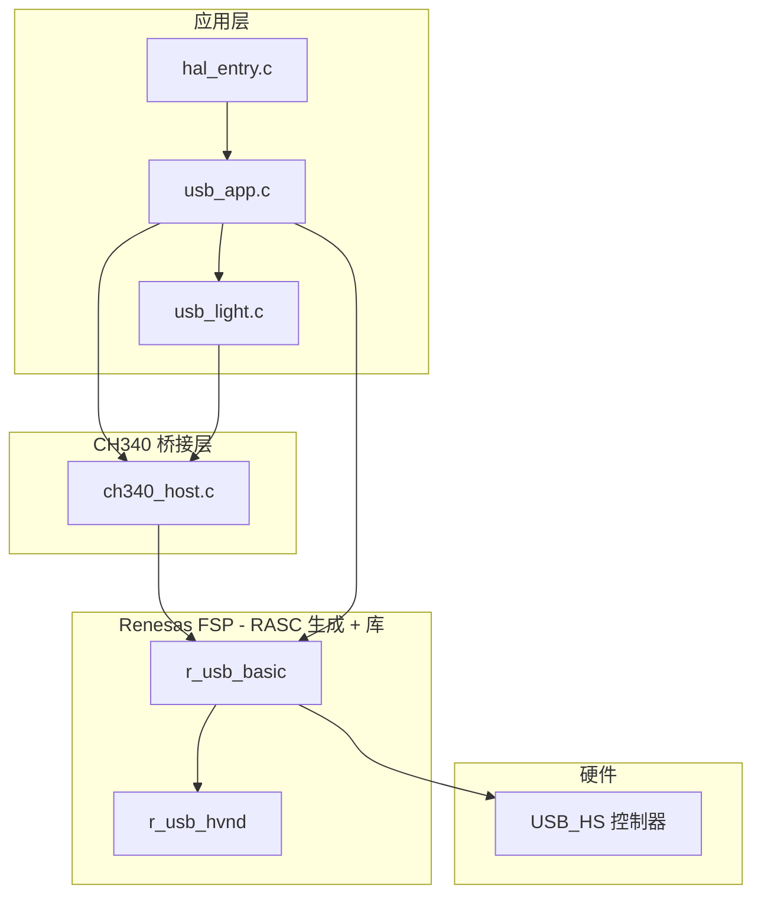
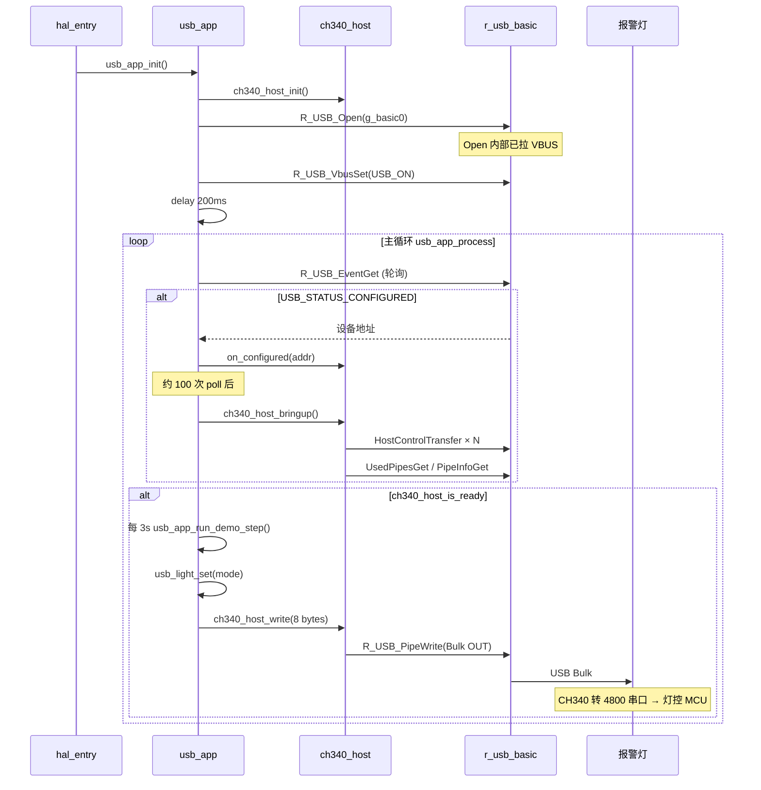
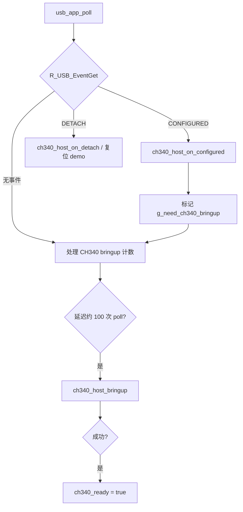
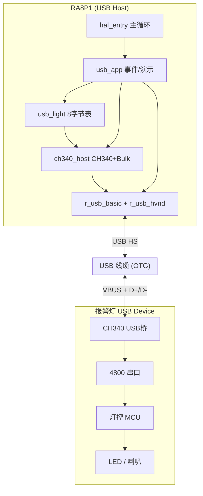

# RA8P1 USB Host 控制报警灯 — 整体说明

本文档面向不熟悉 USB 的读者，说明本工程 `hardware/ra8p1/demo/usb_light` 的**硬件连接、协议分层、软件流程、FSP 关键 API** 及调试要点。灯控字节定义仍以 [`usb_light需求.md`](usb_light需求.md) 为准。

---

## 1. 用一句话理解本工程

RA8P1 作为 **USB 主机（Host）**，通过 **USB 高速口（USB_HS / USB_IP1）** 给报警灯供电并通信；灯内 **CH340** 把 USB 转成 **4800 8N1 串口**，应用层只需往 Bulk OUT 写 **8 字节**（与串口调试助手 HEX 发送相同），灯内 MCU 按 Modbus 风格解析后驱动 LED/喇叭。

```
[RA8P1 Host] --USB线--> [报警灯: CH340 + 灯控MCU + LED]
                              ^
                              等价于 PC 上 "USB-SERIAL CH340 (COMx)" + 串口助手发 HEX
```

---

## 2. USB 协议极简（与本工程相关的部分）

| 概念 | 含义 | 在本工程中的体现 |
|------|------|------------------|
| **Host / Device** | 主机发起枚举、供电；设备被识别 | RA8P1 = Host；报警灯 = Device |
| **枚举（Enumeration）** | 主机读设备描述符、分配地址、选配置 | FSP 自动完成，应用收到 `USB_STATUS_CONFIGURED` |
| **端点（Endpoint）** | 实际传数据的通道 | CH340 使用 **Bulk OUT** 发串口数据到灯 |
| **控制传输（Control）** | 配置芯片用（标准/厂商请求） | 用于 CH340 初始化（波特率、DTR/RTS 等） |
| **Bulk 传输** | 大块数据、无固定格式 | 发送 8 字节灯控命令 |
| **类（Class）** | 系统识别设备用途 | CH340 为 **厂商类 0xFF**，故用 **r_usb_hvnd**（Host Vendor），不用 CDC 驱动栈 |

本工程**不实现**完整 USB 协议栈细节，由 Renesas **`r_usb_basic` + `r_usb_hvnd`** 完成；应用只做：开 Host → 等事件 → 初始化 CH340 → Bulk 写字节。

---

## 3. RASC / 硬件配置摘要

| 项 | 配置 |
|----|------|
| USB 模式 | **Host** |
| 速度 | **Hi-Speed** |
| USB 模块 | **USB_IP1**（USB_HS） |
| 类驱动栈 | **g_hvnd0** → **g_basic0**（`USB_CLASS_HVND`） |
| 引脚 | **P407** = USBHS_VBUSEN，**P408** = USBHS_VBUS；DP/DM 为专用 USBHS 脚 |
| 时钟 | **USBCLK** = PLL2R÷10（48MHz） |
| TPL | `USB_NOVENDOR, USB_NOPRODUCT`（接受任意 VID/PID） |

生成代码入口：`ra_gen/hal_data.c` 中的 `g_basic0` / `g_basic0_cfg` / `g_basic0_ctrl`。

---

## 4. 软件分层与源文件



| 文件 | 职责 |
|------|------|
| `hal_entry.c` | 上电后 `usb_app_init()`，主循环调用 `usb_app_process()` |
| `usb_app.c` | USB 事件轮询、演示时序、CH340 延迟初始化触发 |
| `ch340_host.c` | CH340 厂商控制传输 + 查找 Bulk OUT 管道 + `R_USB_PipeWrite` |
| `usb_light.c` | 需求文档中的 **27×8 字节** 固定表，`usb_light_set()` 原样发送 |
| `ra_gen/hal_data.c` | `g_basic0` 实例（Host/HS/IP1/HVND） |

---

## 5. 上电到点亮的整体流程



---

## 6. 主程序与演示逻辑

### 6.1 主循环

```text
hal_entry()
  └─ usb_app_init()          // 一次性
  └─ while (1)
        └─ usb_app_process()
              ├─ 10 × ( usb_app_poll() + delay 1ms )   // 保证 USB 任务持续运行
              └─ 若 CH340 就绪且满 3s → usb_app_run_demo_step()
```

### 6.2 演示灯序（每步间隔约 3 秒）

| 顺序 | `usb_light_mode_t` | 需求文档指令（8 字节） |
|------|-------------------|------------------------|
| 1 | `USB_LIGHT_RED_ON` | `01 06 00 C2 00 11 E8 3A` |
| 2 | `USB_LIGHT_GREEN_ON` | `01 06 00 C2 00 13 69 FB` |
| 3 | `USB_LIGHT_BLUE_ON` | `01 06 00 C2 00 18 28 3C` |
| 4 | `USB_LIGHT_RED_SLOW` | `01 06 00 C2 00 21 E9 FE` |
| 5 | `USB_LIGHT_RED_FAST_HORN` | `01 06 00 C2 00 34 28 34` |
| 6 | `USB_LIGHT_OFF` | `01 06 00 C2 00 60 E9 EB` |

然后回到第 1 步循环。拔线会复位步骤计数。

---

## 7. USB 事件处理流程



**说明**：`R_USB_EventGet` 在无 RTOS 时会调用内部 `usb_cstd_usb_task()`，因此必须**周期性轮询**，不能长时间阻塞；本工程用 1ms 切片轮询兼顾演示定时。

---

## 8. CH340 初始化流程（`ch340_host_bringup`）

灯作为 USB 设备插入并被枚举后，CH340 尚未处于「4800 串口可用」状态，需通过 **USB 厂商控制传输** 配置（参考 Linux `ch341` 驱动思路）：


之后 `ch340_host_write()` 仅向该 Bulk OUT 管道写入 **8 字节**，**不**附加 `\r\n`（与串口助手「HEX 发送、不发空行」一致）。

---

## 9. 灯控命令路径（应用最关心）

```text
usb_light_set(mode)
  └─ 从 g_usb_light_frames[] 拷贝 8 字节（与 usb_light需求.md 一致）
  └─ ch340_host_write(frame, 8)
        └─ memcpy 到对齐缓冲区 tx_buf[8]
        └─ R_USB_PipeWrite(..., pipe_bulk_out)
```

**重要**：`usb_instance_ctrl_t` 调用 `R_USB_PipeWrite` 前必须设置：

- `module_number` = `g_basic0_cfg.module_number`（本工程为 **1**，即 USB_IP1）
- `type` = **`USB_CLASS_HVND`**（与 `R_USB_Open` 时打开的类一致，否则 PipeWrite 参数检查失败）

---

## 10. FSP 关键 API 一览

以下均在裸机（`BSP_CFG_RTOS == 0`）下由应用**主动轮询**使用。

### 10.1 USB 基本（`r_usb_basic` / `g_usb_on_usb`）

| API | 调用位置 | 作用 |
|-----|----------|------|
| `R_USB_Open(&g_basic0_ctrl, &g_basic0_cfg)` | `usb_app_init` | 以 **Host + HVND** 打开 USB_HS；内部初始化硬件、默认拉 VBUS |
| `R_USB_VbusSet(p_ctrl, USB_ON)` | `usb_app_init` | 显式打开 VBUS 供电（P407 VBUSEN） |
| `R_USB_EventGet(p_ctrl, &event)` | `usb_app_poll` / `ch340_host` 等待控制传输完成 | 取事件；内部跑 USB 任务。常见 `event`：`USB_STATUS_CONFIGURED`、`USB_STATUS_DETACH`、`USB_STATUS_REQUEST_COMPLETE` |
| `R_USB_HostControlTransfer(p_ctrl, &setup, buf, dev_addr)` | `ch340_host.c` | CH340 厂商请求（读版本、设波特率等） |
| `R_USB_UsedPipesGet(p_ctrl, &used, dev_addr)` | `ch340_host.c` | 位图：哪些 Pipe 已注册 |
| `R_USB_PipeInfoGet(p_ctrl, &info, pipe_num)` | `ch340_host.c` | 查询管道类型、端点方向 |
| `R_USB_PipeWrite(p_ctrl, buf, len, pipe_num)` | `ch340_host.c` | **Bulk OUT** 发送灯控 8 字节 |

**控制传输 setup 打包**（本工程约定）：

```c
setup.request_type   = (bRequest << 8) | bmRequestType;  // 如 IN: 0xC0 区域 + 0x5F
setup.request_value  = wValue;
setup.request_index  = wIndex;
setup.request_length = wLength;
```

### 10.2 未使用的栈

| 模块 | 原因 |
|------|------|
| `r_usb_hcdc` | CH340 在系统中呈现为 **Vendor 0xFF**，不是标准 CDC ACM |
| FreeRTOS USB 回调 | 本工程裸机 + `EventGet` 轮询 |

---

## 11. 本工程应用层 API

| API | 头文件 | 说明 |
|-----|--------|------|
| `usb_app_init()` | `usb_app.h` | 初始化 CH340 模块、打开 USB、VBUS、延时 |
| `usb_app_process()` | `usb_app.h` | 主循环中调用：轮询 USB + 演示节拍 |
| `usb_app_poll()` | `usb_app.h` | 仅事件与 CH340 bringup（一般通过 `process` 调用） |
| `usb_app_is_ready()` | `usb_app.h` | CH340 是否配置完成 |
| `usb_app_run_demo_step()` | `usb_app.h` | 执行演示序列中的一步 |
| `usb_light_set(mode)` | `usb_light.h` | 发送某一种灯态（8 字节固定表） |
| `ch340_host_*` | `ch340_host.h` | 桥接层，通常仅 `usb_app` / `usb_light` 调用 |

扩展业务时，在 `ch340_host_is_ready()` 为真后调用 `usb_light_set(USB_LIGHT_xxx)` 即可。

---

## 12. 调试变量（Keil Watch）

| 变量 | 含义 |
|------|------|
| `g_usb_app_debug.configured_seen` | `1` = 已收到 `USB_STATUS_CONFIGURED`（枚举到配置态） |
| `g_usb_app_debug.configured_addr` | USB 设备地址（通常为 1） |
| `g_usb_app_debug.ch340_ready` | `1` = CH340 初始化完成，可发灯命令 |
| `g_usb_app_debug.ch340_bringup_err` | `ch340_host_bringup()` 返回值 |
| `g_usb_app_debug.last_light_err` | 最近一次 `usb_light_set()` 返回值 |
| `g_usb_app_debug.last_usb_event` | 最近一次 USB 事件码（整型，对应 `usb_status_t`） |
| `g_usb_light_last_frame[8]` | 最近一次发出的 8 字节，应与串口助手 HEX 一致 |

---

## 13. 与 PC 串口调试助手的对应关系

| PC 侧 | RA8P1 本工程 |
|-------|----------------|
| 插入 USB，出现 COM 口 | Host 枚举，事件 `CONFIGURED` |
| 串口 4800, 8N1 | `ch340_host_bringup()` 中 CH340 寄存器配置 |
| HEX 发送 `01 06 ...`（8 字节，无换行） | `R_USB_PipeWrite` 发相同 8 字节 |
| 灯亮/闪/响 | 同左 |

---

## 14. 常见问题速查

| 现象 | 可能原因 |
|------|----------|
| 能充电、灯不亮 | 仅 VBUS 有电；检查 `configured_seen`、`ch340_ready` |
| `ch340_ready` 一直 0 | 未枚举、管道未找到、控制传输超时；线材需 **OTG**、接 **USB_HS** 口 |
| `last_light_err` 非 0 | 多为 `PipeWrite` 失败；确认 `p_ctrl->type == USB_CLASS_HVND` |
| 帧正确仍不亮 | 对比 `g_usb_light_last_frame` 与需求文档；再查硬件/供电 |
| 演示不按 3s 变化 | 确认主循环调用的是 `usb_app_process()` 而非阻塞延时 |

---

## 15. 构建与文档索引

| 项 | 路径 |
|----|------|
| Keil 工程 | `usb_light.uvprojx` |
| RASC 配置 | `configuration.xml` |
| 灯控字节表 | `usb_light需求.md` |
| **复用到其他工程** | [USB报警灯Host复用指南.md](USB报警灯Host复用指南.md) |
| 产品说明书 | `docs/模块资料/USB可编程台灯/USB报警灯使用说明书V2.md` |
| FSP 版本 | 6.4.0（见 `ra_cfg.txt`） |

---

## 16. 架构总览（一图）



---

*文档版本：与当前 `src/` 实现一致；若 RASC 或演示序列有变更，请同步更新本节与 `usb_light需求.md`。*
