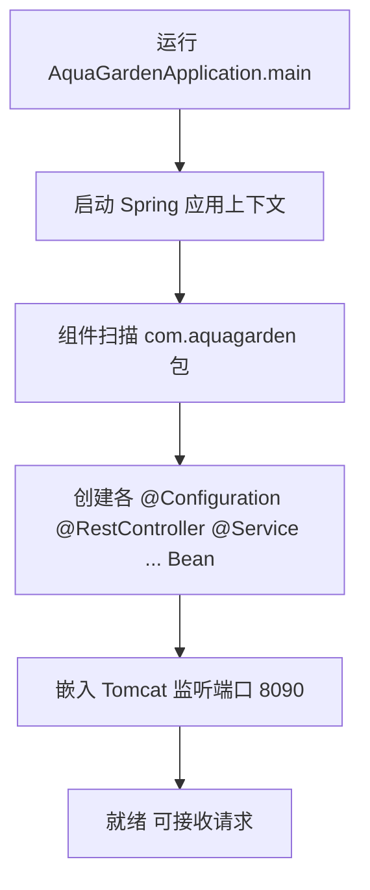

# Spring Boot 入门：核心概念、请求处理逻辑与在本项目中的实操

面向「能启动项目、想搞清一次 HTTP 请求在工程里怎么走」的初学者。建议边读边打开 `backend-spring`，按 **实操任务** 改配置或加日志观察行为。

---

## 第一部分：Spring Boot 在解决什么问题

传统 Java Web：要自己搭 Servlet 容器、整合各种库、写大量 XML 配置。

**Spring Boot** 的定位：**约定优于配置**——帮你选好常用组合（Web、JSON、数据源等），用 **起步依赖（Starter）** 一条坐标引入一整条能力链，并用 **`application.properties`** 集中改端口、数据库 URL 等。

你的项目是一个典型的 **「提供 HTTP JSON API + WebSocket」** 的后端，没有服务端渲染的 HTML 页面。

---

## 第二部分：三个最基础概念——IoC、Bean、依赖注入（DI）

### 2.1 IoC（控制反转）

**以前**：你的类里 `new UserService()`，**由你决定**什么时候创建、依赖谁。  
**Spring**：由 **容器** 在启动时创建对象、管理生命周期；你的类只 **声明我需要什么**，容器 **注入** 进来。控制权「反转」给框架，故称 IoC。

### 2.2 Bean

被 Spring 容器创建并管理的对象，叫作 **Bean**。  
带 **`@Component`** 及其派生注解的类，通常会被扫描成 Bean（在 **组件扫描路径** 下）。

常见派生注解：

| 注解 | 典型用途 |
|------|----------|
| **`@RestController`** | 对外提供 REST 接口（返回 JSON）。 |
| **`@Service`** | 业务逻辑层。 |
| **`@Repository`** | 数据访问（JPA 里接口也可用 `@Repository`，本项目接口继承 `JpaRepository` 即可被识别）。 |
| **`@Configuration`** | 配置类，里面常配合 **`@Bean`** 方法注册第三方组件。 |

### 2.3 依赖注入（DI）

**构造器注入**（推荐，本项目普遍写法）：

```java
public class AuthController {
    private final AuthService authService;

    public AuthController(AuthService authService) {
        this.authService = authService;
    }
}
```

Spring 发现你要 `AuthController`，会先准备好 `AuthService`，再传进构造器。**你不需要自己 `new`**。

**实操 1**：打开任意 `*Controller.java`，按住 Ctrl 点构造器参数类型，跳到对应 `Service` 或 `Repository`，体会「控制器只负责 HTTP，业务在 Service」。

---

## 第三部分：启动时发生了什么——从 `main` 到容器就绪



1. **`AquaGardenApplication.java`** 上的 **`@SpringBootApplication`** 是一组注解的集合，包含：  
   - **`@SpringBootConfiguration`**：标记这是 Boot 应用配置类。  
   - **`@EnableAutoConfiguration`**：根据 classpath 上的 jar 自动配置（例如发现 Spring MVC 就配 DispatcherServlet）。  
   - **`@ComponentScan`**：默认扫描 **当前类所在包及其子包**（即 `com.aquagarden`），所以各子包的 `@RestController` 等都会被注册。

2. **`DataInitializer`** 实现了 **`ApplicationRunner`**，在上下文就绪后执行一次：若没有 `admin` 用户则插入默认账号。

**实操 2**：在 `AquaGardenApplication.java` 的 `main` 方法里，`SpringApplication.run` 下一行加一行日志或断点，确认「启动完成」的执行顺序。

---

## 第四部分：一次 HTTP 请求在 Spring MVC 里怎么走（以 GET 为例）

简化后的链路：

```mermaid
sequenceDiagram
  participant Client as 浏览器/前端
  participant Tomcat as Tomcat
  participant DS as DispatcherServlet
  participant C as Controller 方法

  Client->>Tomcat: GET /api/sensors + Header
  Tomcat->>DS: 交给 Spring MVC 前端控制器
  DS->>C: 根据路径匹配到某 @GetMapping 方法
  C-->>DS: 返回对象或 ResponseEntity
  DS-->>Client: 序列化为 JSON 响应
```



你需要记住的对应关系：

| 概念 | 说明 |
|------|------|
| **`DispatcherServlet`** | Spring MVC 的入口 Servlet，把请求分发给合适的 Controller 方法。 |
| **`@RestController`** | = `@Controller` + `@ResponseBody`，方法返回值直接作为 **HTTP 响应体**（通常序列化为 JSON）。 |
| **`@GetMapping` / `@PostMapping`** | 声明「什么 HTTP 方法 + 什么路径」进入该方法。 |
| **方法参数** | 可加 `@RequestBody` 接收 JSON 体、`@PathVariable` 路径变量等。 |

**实操 3**：打开 `SensorController.java`，找到 `@GetMapping("/api/sensors")` 的方法，在方法第一行打断点，用浏览器或 Postman（带 Token）访问一次，看调试器是否进入。

---

## 第五部分：Spring Security 在本项目中的角色（简化理解）

**安全框架**在请求到达 Controller **之前** 可以插入一串 **过滤器（Filter）**。

本项目自定义了 **`JwtAuthFilter`**：

- 对需要登录的接口：检查请求头里是否有 **`Authorization: Bearer <token>`**，校验 JWT，通过则把「当前用户名」放进 **`SecurityContext`**（表示已认证）。  
- 对放行路径（如 `/api/login`、`/api/register`、部分视频与 WebSocket）：不拦或不要求登录。

**`SecurityConfig`** 里用 **`SecurityFilterChain`** 声明：哪些 URL 允许匿名、哪些必须认证、把 **`JwtAuthFilter`** 插在 UsernamePassword 认证过滤器之前。

**实操 4**：阅读 `SecurityConfig.java` 里的 `authorizeHttpRequests`，列出三条你理解的「允许匿名访问的路径」，并对照前端 `http.js` 里哪些请求会带 Token。

---

## 第六部分：JPA——`Entity` 与 `Repository`

**JPA（Jakarta Persistence）**：用 **实体类** 映射数据库表，用 **Repository 接口** 描述增删改查，运行时由 Hibernate 等实现生成 SQL。

| 概念 | 本项目中的例子 |
|------|----------------|
| **`@Entity`** | `User.java` 映射表 `users`。 |
| **`JpaRepository<User, Integer>`** | `UserRepository` 继承后自动拥有 `save`、`findById`、`findAll` 等，并可声明 `findByUsername` 等方法名由框架解析。 |
| **`application.properties`** | `spring.datasource.url`、`spring.jpa.hibernate.ddl-auto` 等控制连哪个库、是否自动建表。 |

**实操 5**：启动应用后，到项目运行目录下查看是否生成 **`aquagarden.db`**；用 [DB Browser for SQLite](https://sqlitebrowser.org/) 打开，看 `users` 表结构是否与 `User.java` 字段对应。

---

## 第七部分：`application.properties`——改这里就能改行为

常见项（名称以你仓库实际为准）：

| 配置项 | 作用 |
|--------|------|
| **`server.port`** | HTTP 端口，默认 8090。 |
| **`spring.datasource.url`** | JDBC URL，本项目为 SQLite 文件。 |
| **`spring.jpa.hibernate.ddl-auto`** | 如 `update`：表结构随实体更新（开发方便，生产需谨慎）。 |
| **`aquagarden.jwt.*`** | 自定义的 JWT 密钥与过期时间。 |

**实操 6**：临时把 **`server.port`** 改成 **8091**，重启应用；同时把前端 `vite.config.js` 的 **`proxy.target`** 改成 `http://localhost:8091`，再试登录，体会「前后端口要一致或通过代理对齐」。

---

## 第八部分：WebSocket 在本项目中的位置

**`WebSocketConfig`** 向 Spring 注册：路径 **`/ws/logs`** 由 **`LogWebSocketHandler`** 处理。

**`LogWebSocketHandler`** 维护连接列表，可 **广播** 文本消息；**`RobotController`** 等在业务发生时调用广播。

**`WebSocketHeartbeat`** 用 **`@Scheduled`** 定时发心跳类消息。

**实操 7**：在 `LogWebSocketHandler.afterConnectionEstablished` 里打日志，启动前端进入仪表板，看控制台是否在连接建立时打印。

---

## 第九部分：与 `pom.xml`、目录的对应关系（速查）

| 你想理解的内容 | 建议阅读 |
|----------------|----------|
| 用了哪些库、Spring Boot 版本 | `pom.xml` |
| HTTP 接口入口 | `com.aquagarden.web.*Controller` |
| 全局错误格式 | `GlobalExceptionHandler.java` |
| 登录注册发 Token | `AuthController` + `AuthService` + `JwtService` |
| 鉴权过滤器 | `security/JwtAuthFilter.java` + `config/SecurityConfig.java` |
| 数据库用户 | `entity/User.java` + `repo/UserRepository.java` |
| 启动初始化数据 | `config/DataInitializer.java` |
| 实时日志推送 | `websocket/LogWebSocketHandler.java` + `config/WebSocketConfig.java` |

---

## 第十部分：推荐学习顺序（结合本仓库）

1. 跑通 `mvn spring-boot:run`，用 Postman 调通 **`POST /api/login`**，理解返回的 `access_token`。  
2. 带 **`Authorization: Bearer ...`** 调 **`GET /api/sensors`**。  
3. 读 **`AuthController` → `AuthService` → `UserRepository`** 一条注册/登录链。  
4. 读 **`SecurityConfig` + `JwtAuthFilter`**，对照「带 Token / 不带 Token」两种请求。  
5. 读 **`SensorController` + `SystemStateService`**，理解「无数据库的内存演示数据」与「有数据库的 User」如何共存。  
6. 官方文档选读：[Spring Boot 特性](https://docs.spring.io/spring-boot/reference/index.html)、[Spring MVC](https://docs.spring.io/spring-framework/reference/web/webmvc.html)、[Spring Security Servlet](https://docs.spring.io/spring-security/reference/servlet/index.html)（先读概念章节即可）。

完成 **实操 1～7** 后，你对「请求进 Tomcat → 过滤器 → Controller → Service/Repository → 返回 JSON」会有整体画面；再深入可学习 **事务 `@Transactional`、校验 `@Valid`、测试 `@SpringBootTest`** 等。

---

## 附录：和 Vue 前端如何对上号

| 前端（浏览器里看到的） | 后端 |
|------------------------|------|
| `fetch('/api/login', { method: 'POST', body: ... })` | `AuthController` 的 `@PostMapping("/api/login")` |
| 请求头 `Authorization: Bearer ...` | `JwtAuthFilter` 解析并建立认证 |
| `new WebSocket(wsLogsUrl())` | `WebSocketConfig` 注册的 `/ws/logs` |

前后端 **路径、方法、JSON 字段名** 一致，联调才能一次通过；改一方时记得同步另一方或接口文档。
