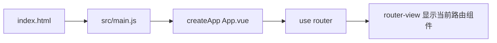

# Vue 3 入门：核心概念、运行逻辑与在本项目中的实操

面向「能跑起来项目、想搞懂代码从哪进、从哪出」的初学者。建议边读边打开 `front-vue` 工程，按 **实操任务** 改一两行代码看效果。

---

## 第一部分：Vue 3 在解决什么问题

传统网页：HTML 里写结构，JS 里用 `document.getElementById` 改文字、改样式，**数据和页面容易不同步**。

Vue 的思路：**把「页面显示」和「数据」绑在一起**。数据变了，依赖这块数据的界面会自动更新（**响应式**）。你只关心「数据是什么」，少写大量手动操作 DOM 的代码。

本仓库里，**一个界面 ≈ 一个 `.vue` 文件**（单文件组件，SFC），再配合 **Vue Router** 决定「当前 URL 显示哪个界面」。

---

## 第二部分：单文件组件（`.vue`）长什么样

每个 `.vue` 通常三块（顺序可调整）：

```vue
<template>
  <!-- 这里写「长得像 HTML」的界面结构 -->
</template>

<script setup>
// 这里写逻辑：变量、函数、请求接口、监听路由等
</script>

<style scoped>
/* 可选：只作用于本组件的样式 */
</style>
```

| 区块 | 作用 |
|------|------|
| **`<template>`** | 描述界面结构。里面的标签可绑定数据、事件。 |
| **`<script setup>`** | **组合式 API（Composition API）** 写法：顶层的 `const` / `function` 可直接在模板里用。 |
| **`<style scoped>`** | 样式只加在本组件根元素上，避免污染全局（本项目中不少样式在全局 `main.css`，子页也可能 `@import` 独立 css）。 |

**实操 1**：打开 `src/views/LoginView.vue`，在 `<template>` 里给某个文字外包一层 `<strong>`，保存后看浏览器是否立刻变化（开发模式下通常 **热更新**，不用整页刷新）。

---

## 第三部分：响应式——`ref` 与模板绑定

**响应式**：普通 JS 变量改了，界面不会变；用 Vue 提供的包装后，改了会触发界面更新。

最常用的包装是 **`ref`**：

```js
import { ref } from 'vue'

const count = ref(0)
// 在 script 里读写要用 .value
count.value = 1
```

```html
<!-- 在 template 里会自动解包，不用写 .value -->
<button @click="count++">{{ count }}</button>
```

**为什么要有 `.value`？**  
`ref` 返回的是一个对象 `{ value: 0 }`，Vue 才能拦截对 `value` 的修改。模板里为了省事，自动帮你解包。

**实操 2**：在任意一个 `views/*.vue` 的 `<script setup>` 里增加：

```js
const demo = ref('你好 Vue')
```

在对应 `<template>` 里某处写 `{{ demo }}`，保存后在浏览器里确认文字出现。

---

## 第四部分：从「打开页面」到「看到界面」——本项目的启动链

下面这条链建议你 **对照文件走一遍**，比背概念快。



1. **`index.html`**  
   只有一个 `<div id="app"></div>` 和一行引入 `src/main.js`。这是 Vite 打包/开发时的 HTML 入口。

2. **`src/main.js`**  
   - `createApp(App)`：用根组件 `App.vue` 创建应用实例。  
   - `app.use(router)`：挂上路由。  
   - `app.mount('#app')`：把应用挂到页面上的 `#app` 里。

3. **`src/App.vue`**  
   当前项目里根组件几乎只有一句：`<router-view />`。意思是：**具体画什么页面，交给路由决定**。

4. **`src/router/index.js`**  
   定义路径与组件的对应表，例如 `/login` → `LoginView`，`/` → 带侧栏的 `AppLayout`，其 **子路由** 再决定是仪表板还是摄像头页等。

**实操 3**：打开 `src/router/index.js`，找到 `dashboard` 那条路由，把 `meta.title` 改成一句你自己的话；再打开浏览器看 **顶栏标题**（标题在 `AppLayout.vue` 里用 `route.meta.title` 显示）。体会：**改配置 → 界面变**。

---

## 第五部分：Vue Router——URL 和组件的对应表

**路由**做两件事：

1. **地址栏路径**（如 `/robot`）对应 **哪个组件**。  
2. **导航守卫**：在跳转前做检查（本项目里检查是否已登录）。

关键概念：

| 概念 | 含义 |
|------|------|
| **`routes`** | 路由表：path、component、children、meta。 |
| **`router-link`** | 声明式导航，像超链接，但由 Vue 处理切换、不整页刷新。 |
| **`router-view`** | 「插槽」：当前匹配到的组件渲染在这里。 |
| **`useRoute()`** | 在组件里读当前路由信息（path、meta、query）。 |
| **`useRouter()`** | 编程式导航，如 `router.push('/login')`。 |

**嵌套路由**：本项目中 `/` 使用 `AppLayout`，其 `children` 里的页面会渲染在 **`AppLayout` 内部的 `<router-view />`** 里，所以侧栏常驻、右侧内容随子路由变化。

**实操 4**：在浏览器已登录状态下访问 `/robot`，再在 `AppLayout.vue` 里看 `<router-view />` 的位置，对照 `RobotView.vue` 的模板，理解「布局 + 子页面」拼装关系。

---

## 第六部分：常见模板语法（够读懂本项目）

| 语法 | 含义 |
|------|------|
| `{{ expr }}` | 把表达式的结果显示在页面上。 |
| `:src="url"` | **v-bind** 缩写：把属性 `src` 绑定到变量 `url`，`url` 变则 `src` 变。 |
| `@click="fn"` | **v-on** 缩写：点击时调用 `fn`（可传参 `@click="fn(1)"`）。 |
| `v-if` / `v-for` | 条件渲染、列表渲染（本项目中 `v-for` 出现在日志列表等）。 |
| `v-model` | 表单双向绑定（如输入框与变量同步）。 |

**实操 5**：在 `DashboardView.vue` 里找到 `@click` 或 `v-model`，各改一处小逻辑（例如按钮点击时 `pushLog` 多打一行字），保存后在仪表板验证。

---

## 第七部分：生命周期——`onMounted` 为什么到处出现

组件被插入页面后，往往需要：**拉数据、开定时器、连 WebSocket**。适合写在 **`onMounted`** 里（组件挂载完成后执行一次）。

对称地，离开页面或组件销毁时，用 **`onUnmounted`** 清理定时器、关闭 WebSocket，避免内存泄漏。

**实操 6**：打开 `src/views/DashboardView.vue`，在 `onMounted` 第一行加 `console.log('仪表板挂载了')`，打开浏览器 **开发者工具 → Console**，进入仪表板看是否打印。

---

## 第八部分：Vite 是什么（和 Vue 的关系）

- **Vue**：负责组件、响应式、路由等「应用逻辑」。  
- **Vite**：负责 **开发服务器**（快速启动、热更新）、**打包构建**（`npm run build` 产出 `dist`）、解析 `.vue` 等。

本项目的 **`vite.config.js`** 里配置了 **`server.proxy`**：开发时浏览器只访问 `localhost:5173`，以 **`/api` 开头的请求** 会被转发到 Spring Boot（默认 8090），这样前端代码里写 **`fetch('/api/...')`** 即可，不必处理跨域。

**实操 7**：确认后端已启动，在 `LoginView.vue` 的登录请求前后各打 `console.log`，看 Network 里请求 URL 是否为 `/api/login`、状态码是否为 200。

---

## 第九部分：和本仓库目录的对应关系（速查）

| 你想做的事 | 优先看的目录/文件 |
|------------|-------------------|
| 改登录/注册页 | `src/views/LoginView.vue`、`RegisterView.vue` |
| 改侧栏、顶栏、退出登录 | `src/components/AppLayout.vue` |
| 加一个新页面 + 路由 | `src/views/YourPage.vue` + `src/router/index.js` |
| 改接口地址、Token、WebSocket | `src/api/http.js` |
| 改全局样式 | `src/assets/styles/main.css` |
| 改某一页的独立样式 | `src/assets/styles/*-page.css` 或对应 `.vue` 的 `<style>` |

---

## 第十部分：推荐学习顺序（1～2 天可走完）

1. 跑通 `npm run dev`，登录进入仪表板。  
2. 读 `main.js` → `App.vue` → `router/index.js`，画出「URL → 哪个组件」。  
3. 精读 **`LoginView.vue`**：表单、`ref`、`fetch`、`router.push`。  
4. 精读 **`AppLayout.vue`**：`useRoute` / `useRouter`、子路由出口。  
5. 精读 **`DashboardView.vue`**：`onMounted`、定时器、`ref` 绑定、`wsLogsUrl()`。  
6. 官方文档选读：[Vue 3 简介](https://cn.vuejs.org/guide/introduction.html)、[组合式 API 概述](https://cn.vuejs.org/guide/extras/composition-api-faq.html)、[Vue Router](https://router.vuejs.org/zh/)。

把上面 **实操 1～7** 都做一遍，你对本前端项目的「数据从哪来、界面怎么更新、路由怎么切」会有直观框架；之后再深入 Composition API 高级用法或 Pinia 状态管理会更轻松。
